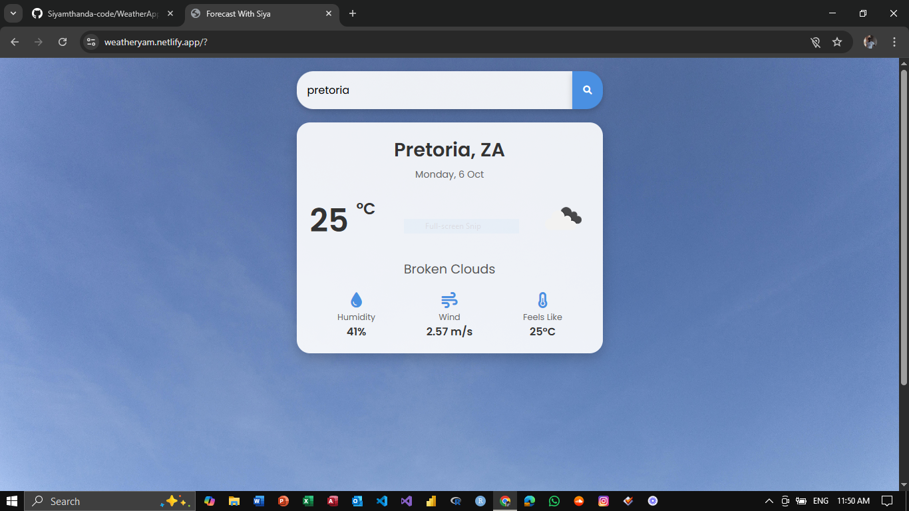
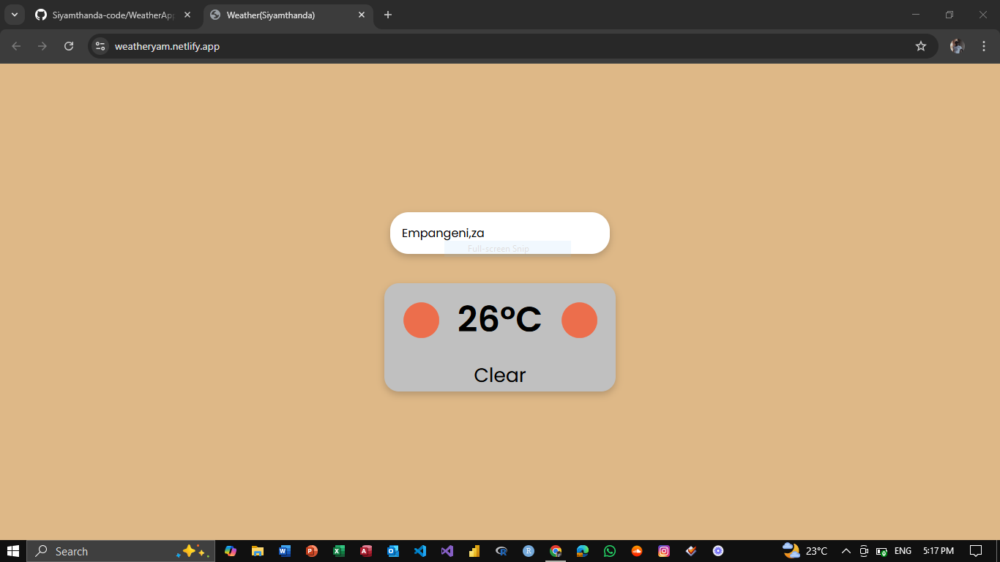

# Weather App

## Description

The Weather App is a simple web application that allows users to search for current weather information by city name. It utilizes the OpenWeatherMap API to fetch weather data and displays it in a user-friendly interface. The app is designed to be responsive and works on both desktop and mobile devices.

## Features

- Search for weather by city name.
- Displays current temperature, weather conditions, and an icon representing the weather.
- Responsive design for mobile and desktop views.
- Error handling for invalid city names.

## Technologies Used

- HTML
- CSS
- JavaScript
- OpenWeatherMap API
